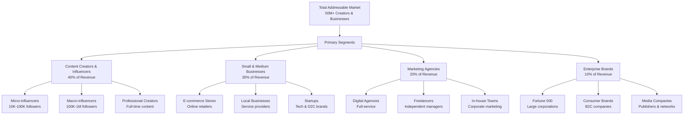
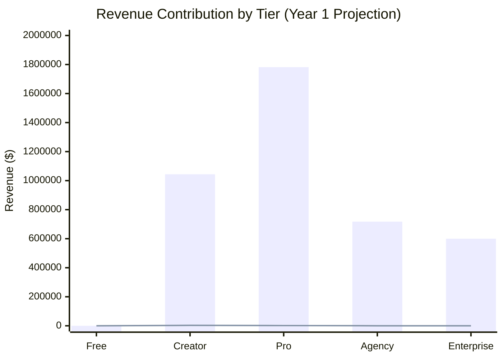
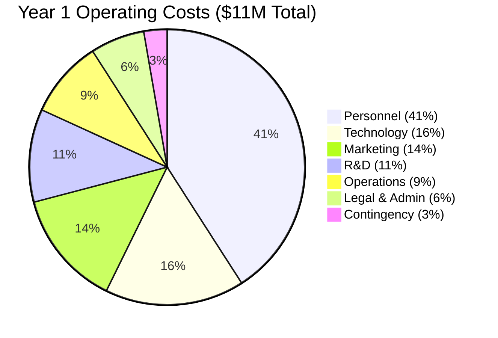

# **Slide: Business Model Canvas**

## **SOCIAL MEDIA INTELLIGENCE PLATFORM BUSINESS MODEL**

---

## **🎯 CUSTOMER SEGMENTS**

### **TARGET MARKET SEGMENTATION**



### **Key Customer Personas**

```
┌─────────────────────────────────────────────────────┐
│           CUSTOMER PERSONA CARDS                   │
├─────────────────────────────────────────────────────┤
│ PERSONA 1: "CREATOR CHLOE"                        │
│ • 28-year-old Instagram/TikTok creator            │
│ • 250K followers across platforms                 │
│ • Earns $5K/month from brand deals                │
│ PAIN POINTS:                                      │
│ • Spends 20+ hours weekly on analytics            │
│ • Can't predict which content will perform        │
│ • Struggles to show ROI to brands                 │
│ NEEDS:                                            │
│ • Time-saving automation                          │
│ • Growth predictions                              │
│ • Professional reporting for sponsors             │
├─────────────────────────────────────────────────────┤
│ PERSONA 2: "STARTUP SAM"                          │
│ • Founder of D2C skincare brand                   │
│ • Small marketing team of 3                       │
│ • $50K monthly social ad spend                    │
│ PAIN POINTS:                                      │
│ • No unified view of performance                  │
│ • Can't attribute sales to social                 │
│ • Losing to competitors with better data          │
│ NEEDS:                                            │
│ • ROI tracking                                    │
│ • Competitor insights                             │
│ • Scalable analytics solution                     │
├─────────────────────────────────────────────────────┤
│ PERSONA 3: "AGENCY ALEX"                          │
│ • Owner of digital marketing agency               │
│ • Manages 25 client accounts                      │
│ • Team of 8 social media managers                 │
│ PAIN POINTS:                                      │
│ • Inconsistent reporting across clients           │
│ • High manual labor costs                         │
│ • Need to prove value to retain clients           │
│ NEEDS:                                            │
│ • White-label reporting                           │
│ • Team collaboration features                     │
│ • Efficiency tools for scaling                    │
└─────────────────────────────────────────────────────┘
```

### **Market Opportunity Sizing**

```
GLOBAL MARKET SIZE:
• Social Media Analytics Market: $9.2B (2023) → $23.1B by 2028
• CAGR: 20.2% (Growing rapidly)
• Our Addressable Segment: $5B+ annually

TARGET PENETRATION:
┌─────────────────────────────────────────────────────┐
│           MARKET PENETRATION TARGETS               │
├──────────────────────┬────────────┬─────────────────┤
│ Customer Segment     │ Total Size │ Year 1 Target   │
├──────────────────────┼────────────┼─────────────────┤
│ Content Creators     │ 50M        │ 0.1% (50,000)   │
│ Small Businesses     │ 200M       │ 0.01% (20,000)  │
│ Marketing Agencies   │ 500K       │ 2% (10,000)     │
│ Enterprise Brands    │ 10K        │ 0.5% (500)      │
├──────────────────────┼────────────┼─────────────────┤
│ TOTAL               │ 260.5M     │ 80,500 customers│
└──────────────────────┴────────────┴─────────────────┘

GEOGRAPHIC FOCUS:
• Primary: North America & Europe (Year 1-2)
• Secondary: Asia-Pacific (Year 3)
• Tertiary: Global expansion (Year 4+)
```

---

## **💎 VALUE PROPOSITION**

### **Core Value Matrix**

```
┌─────────────────────────────────────────────────────┐
│          TRANSFORMING SOCIAL MEDIA ANALYTICS      │
├─────────────────────────────────────────────────────┤
│ FROM...                    TO...                   │
├─────────────────────────────────────────────────────┤
│ Reactive Analytics       → Predictive Intelligence │
│ Descriptive Data         → Prescriptive Actions    │
│ Manual Analysis          → Automated Insights      │
│ Platform Silos           → Unified Dashboard       │
│ Technical Complexity     → Natural Language Queries│
│ Guesswork Strategy       → Data-Driven Decisions   │
│ Time-Consuming Reporting → One-Click Exports       │
│ ROI Uncertainty          → Clear Attribution       │
└─────────────────────────────────────────────────────┘
```

### **Platform Value Pillars**

```
PILLAR 1: AI-POWERED INTELLIGENCE
• Predictive Performance Scoring
• Automated Content Recommendations
• Natural Language Query Interface
• Competitor Benchmarking AI

PILLAR 2: UNIFIED MULTI-PLATFORM
• Single dashboard for 6+ platforms
• Cross-platform performance comparison
• Consolidated reporting
• Unified engagement metrics

PILLAR 3: TIME-SAVING AUTOMATION
• Automated data collection
• AI-generated insights
• One-click report generation
• Smart scheduling recommendations

PILLAR 4: ACCESSIBLE FOR ALL
• No technical skills required
• Chat-based interface
• Educational insights
• Step-by-step recommendations

PILLAR 5: ENTERPRISE-GRADE SCALABILITY
• Team collaboration tools
• White-label options
• API access
• Custom integrations
```

### **Quantifiable Customer Benefits**

```
FOR CREATORS:
• Save 15+ hours weekly = $750/month value (at $50/hr)
• Increase engagement by 25% = Higher brand deal rates
• Grow audience 2x faster = Earlier monetization
• Reduce content creation guesswork = Higher success rate

FOR BUSINESSES:
• Improve social ROI by 30% = Direct revenue impact
• Reduce customer acquisition cost by 20% = Higher margins
• Make decisions 50% faster = Competitive advantage
• Benchmark against competitors = Strategic insights

FOR AGENCIES:
• Serve 40% more clients = Revenue growth
• Reduce reporting time by 70% = Lower labor costs
• Improve client retention by 25% = Stable revenue
• White-label branding = Professional positioning
```

### **Competitive Differentiation**

```
VS. TRADITIONAL ANALYTICS TOOLS:
┌─────────────────────────────────────────────────────┐
│          COMPETITIVE LANDSCAPE                     │
├─────────────────────┬───────────────────────────────┤
│ Feature             │ Our Platform vs Traditional   │
├─────────────────────┼───────────────────────────────┤
│ Intelligence        │ Predictive vs Descriptive     │
│ Interface           │ Chat-based vs Dashboard-only  │
│ Integration         │ All-in-one vs Platform-specific│
│ Recommendations     │ Automated vs Manual           │
│ Learning Curve      │ Minutes vs Weeks              │
│ Reporting           │ Automated vs Manual           │
│ Price              │ Value-based vs Feature-limited │
└─────────────────────┴───────────────────────────────┘

KEY DIFFERENTIATORS:
1. First AI-native social analytics platform
2. Natural language interface (no dashboards needed)
3. Predictive vs retrospective insights
4. True multi-platform unification (not just aggregation)
```

---

## **💰 REVENUE STREAMS**

### **Multi-Tier Pricing Strategy**



### **Detailed Pricing Architecture**

```
TIER 1: FREE (Acquisition Funnel)
• Price: $0/month
• Features: 1 platform, basic metrics, 7-day data
• Target: 100,000+ users (Lead generation)
• Conversion goal: 8% to paid tiers

TIER 2: CREATOR ($29/month)
• Target: Individual creators & micro-influencers
• Features: 3 platforms, full AI, 30-day data
• Annual discount: $290 ($29 saved)
• Projected customers: 3,000 (Year 1)

TIER 3: PRO ($99/month)
• Target: Small businesses & growing creators
• Features: 10 platforms, team (3), competitor tracking
• Annual discount: $1,088 ($100 saved)
• Projected customers: 1,500 (Year 1)

TIER 4: AGENCY ($299/month)
• Target: Marketing agencies & teams
• Features: Unlimited platforms, white-label, 10 seats
• Annual discount: $3,288 ($300 saved)
• Projected customers: 200 (Year 1)

TIER 5: ENTERPRISE (Custom pricing)
• Target: Large brands & corporations
• Starting at: $2,500/month
• Features: Custom solutions, dedicated support, SLA
• Projected customers: 20 (Year 1)
```

### **Revenue Projections**

```
YEAR 1 FINANCIAL PROJECTION:
┌─────────────────────────────────────────────────────┐
│           REVENUE FORECAST - YEAR 1                │
├────────────────────┬────────────┬───────────────────┤
│ Tier              │ Customers  │ Annual Revenue    │
├────────────────────┼────────────┼───────────────────┤
| Creator ($29/mo)  │ 3,000      │ $1,044,000       │
| Pro ($99/mo)      │ 1,500      │ $1,782,000       │
| Agency ($299/mo)  │ 200        │ $717,600         │
| Enterprise        │ 20         │ $600,000         │
| ($2,500/mo)       │            │                   │
├────────────────────┼────────────┼───────────────────┤
| TOTAL ARR         │ 4,720      │ $4,143,600       │
| Monthly Revenue   │            │ $345,300         │
└────────────────────┴────────────┴───────────────────┘

GROWTH PROJECTIONS:
• Year 2: $10M ARR (140% growth)
• Year 3: $25M ARR (150% growth)
• Year 5: $100M ARR (Compound growth)
```

### **Additional Revenue Streams**

```
SECONDARY REVENUE SOURCES:
1. Professional Services (Year 2+)
   • Consulting: $200-$500/hour
   • Implementation: $5,000-$50,000 per project
   • Training: $2,000-$10,000 per session

2. Marketplace & Ecosystem (Year 3+)
   • Commission on recommended tools: 10-20%
   • Premium templates: $19-$99 each
   • API access for developers: $500-$5,000/month

3. Data & Insights (Year 3+)
   • Industry benchmark reports: $999-$5,000
   • Competitive intelligence: $2,000-$10,000/month
   • Market research data: Custom pricing

4. White-label Solutions
   • Agency licensing: 20-40% revenue share
   • Reseller programs: 30% commission
   • OEM partnerships: License fees
```

### **Revenue Mix Evolution**

```
REVENUE MIX BY YEAR:
YEAR 1:
• Subscription: 95%
• Services: 5%

YEAR 3:
• Subscription: 70%
• Services: 15%
• Marketplace: 10%
• Data: 5%

YEAR 5:
• Subscription: 60%
• Services: 20%
• Marketplace: 15%
• Data: 5%
```

---

## **💸 COST STRUCTURE**

### **Cost Breakdown Visualization**



### **Detailed Cost Components**

```
FIXED OPERATIONAL COSTS:
1. PERSONNEL ($4.5M/year)
   ┌────────────────────────────────────────────┐
   │ Team Structure (33 People)                │
   ├────────────────────────────────────────────┤
   │ • Engineering (12): $1.8M                 │
   │ • AI/ML (4): $800K                        │
   │ • Product & Design (4): $700K             │
   │ • Marketing & Sales (6): $900K            │
   │ • Customer Success (4): $500K             │
   │ • Leadership (3): $600K                   │
   └────────────────────────────────────────────┘

2. TECHNOLOGY INFRASTRUCTURE ($1.8M/year)
   • Cloud Hosting (AWS/GCP): $100,000/month
   • Social Platform API Costs: $15,000/month
   • AI Model Training/Inference: $30,000/month
   • Database & Storage: $8,000/month
   • CDN & Security: $7,000/month

3. DEVELOPMENT & R&D ($1.2M/year)
   • New Feature Development: $80,000/month
   • Platform API Maintenance: $20,000/month
   • AI Model Improvements: $15,000/month
   • Security & Compliance: $5,000/month

VARIABLE COSTS:
1. CUSTOMER ACQUISITION (CAC)
   • Digital Advertising: $50-100 per customer
   • Content Marketing: $20-40 per customer
   • Partnerships: $30-60 per customer
   • AVERAGE CAC: $75 (Creator), $150 (Pro), $500 (Agency)

2. PAYMENT PROCESSING
   • Stripe/PayPal: 2.9% + $0.30 per transaction
   • Annual Processing Fees: ~$120,000/year

3. CUSTOMER SUPPORT
   • Support Tickets: $10-15 per ticket
   • Onboarding: $30-50 per customer
   • Success Management: $100-500 per enterprise
```

### **Unit Economics Analysis**

```
LIFETIME VALUE (LTV) CALCULATION:
┌─────────────────────────────────────────────────────┐
│           LIFETIME VALUE BY TIER                   │
├─────────┬──────────┬──────────┬─────────┬──────────┤
│ Tier    │ Monthly  │ Avg Life │ Gross   │ LTV      │
│         │ Price    │ (Months) │ Margin  │          │
├─────────┼──────────┼──────────┼─────────┼──────────┤
│ Creator │ $29      │ 18       │ 80%     │ $417.60  │
│ Pro     │ $99      │ 24       │ 85%     │ $2,019.60│
│ Agency  │ $299     │ 36       │ 90%     │ $9,687.60│
│ Enterp. │ $2,500   │ 48       │ 95%     │ $114,000 │
└─────────┴──────────┴──────────┴─────────┴──────────┘

CUSTOMER ACQUISITION COST (CAC) RECOVERY:
┌─────────────────────────────────────────────────────┐
│           CAC ANALYSIS & PAYBACK                   │
├─────────┬───────┬───────┬──────────┬───────────────┤
│ Tier    │ CAC   │ LTV   │ LTV:CAC  │ Payback Period│
├─────────┼───────┼───────┼──────────┼───────────────┤
│ Creator │ $75   │ $418  │ 5.6x     │ 3 months      │
│ Pro     │ $150  │ $2,020│ 13.5x    │ 2 months      │
│ Agency  │ $500  │ $9,688│ 19.4x    │ 2 months      │
│ Enterp. │ $2,500│ $114K │ 45.6x    │ 6 months      │
└─────────┴───────┴───────┴──────────┴───────────────┘
```

### **Financial Projections & Breakeven**

```
YEAR 1 FINANCIAL SUMMARY:
┌─────────────────────────────────────────────────────┐
│           YEAR 1 FINANCIAL OVERVIEW                │
├─────────────────────────────────────────────────────┤
│ Revenue:                    $4,143,600             │
│ Cost of Goods Sold:        $828,720 (20% of rev)   │
│ Gross Profit:              $3,314,880 (80% margin) │
│ Operating Expenses:        $11,000,000             │
│ Net Loss:                 ($7,685,120)             │
│ Cash Burn Rate:            $916,667/month          │
│ Runway with $10M funding:  10.9 months             │
└─────────────────────────────────────────────────────┘

PATH TO PROFITABILITY:
• Breakeven: 18,000 paying customers
• Target Breakeven: Q3 Year 2
• Cash Flow Positive: Q4 Year 2
• Net Profit Positive: Year 3
```

### **Funding Requirements**

```
SEED FUNDING: $10M
┌─────────────────────────────────────────────────────┐
│           SEED CAPITAL ALLOCATION                  │
├─────────────────────────────────────────────────────┤
│ Product Development (30%):        $3,000,000       │
│ - MVP Development & Launch                         │
│ - AI/ML Model Development                          │
│ - Platform Integrations                            │
│                                                     │
│ Team & Talent (40%):              $4,000,000       │
│ - Key Engineering Hires                            │
│ - AI/ML Specialists                               │
│ - Marketing Leadership                            │
│ - Sales Team Build                                │
│                                                     │
│ Marketing & Customer Acquisition (20%): $2,000,000 │
│ - Launch Marketing Campaign                       │
│ - Content Creation & SEO                          │
│ - Paid Acquisition                                │
│ - Partnership Development                          │
│                                                     │
│ Operations & Legal (10%):          $1,000,000      │
│ - Office & Equipment                              │
│ - Legal & Compliance                              │
│ - Contingency Reserve                             │
└─────────────────────────────────────────────────────┘

MILESTONES FOR SERIES A ($15-20M):
• $1M+ MRR
• 10,000+ paying customers
• <3% monthly churn
• 6+ months of consistent growth
• Enterprise customer traction
```

### **Key Financial Metrics Dashboard**

```
MONTHLY METRICS TO MONITOR:
• MRR Growth Rate: Target 20% month-over-month
• Customer Churn: Target <3% monthly
• CAC Payback Period: Target <3 months
• LTV:CAC Ratio: Target >5:1
• Gross Margin: Target 80-85%
• Burn Rate: $916K/month (Year 1)
• Runway: 10+ months at all times

QUARTERLY BUSINESS REVIEW METRICS:
• Net Revenue Retention: Target >110%
• Magic Number: (ΔMRR × 12) / Sales & Marketing Spend
• Rule of 40: (Growth Rate + Profit Margin) >40%
• Customer Health Score: Based on engagement & usage
```

---

## **📊 BUSINESS MODEL SUMMARY**

### **Business Model Advantages**

```
RECURRING REVENUE MODEL:
• 95%+ subscription revenue (predictable)
• High gross margins (80-85%)
• Low customer churn (<3% monthly)
• Strong unit economics (LTV:CAC 5:1+)

SCALABLE TECHNOLOGY:
• Cloud-native architecture
• Microservices for easy scaling
• Automated infrastructure
• AI-driven efficiency

MARKET POSITIONING:
• First-mover in AI-native social analytics
• Gap between basic tools and enterprise solutions
• Growing market (20%+ CAGR)
• Multiple expansion vectors

INVESTMENT ATTRACTIVENESS:
• Total addressable market: $50B+
• High growth potential (140% YoY)
• Defensible technology (AI/ML moat)
• Multiple exit opportunities
```

### **Risk Assessment & Mitigation**

```
KEY RISKS & MITIGATION STRATEGIES:
1. Platform Dependency Risk
   • Mitigation: Multi-platform support, API monitoring, fallback methods

2. Competition Risk
   • Mitigation: Continuous AI innovation, strong IP, network effects

3. Market Adoption Risk
   • Mitigation: Freemium model, educational content, strong onboarding

4. Technology Risk
   • Mitigation: Experienced team, cloud infrastructure, redundancy

5. Financial Risk
   • Mitigation: Conservative burn, diversified revenue, strong unit economics
```

### **Long-Term Vision**

```
5-YEAR ROADMAP:
YEAR 1-2: PRODUCT-MARKET FIT & SCALE
• Establish leadership in creator & SMB market
• Build strong AI foundation
• Achieve $10M ARR

YEAR 3-4: ENTERPRISE & GLOBAL EXPANSION
• Capture enterprise market
• Expand internationally
• Build marketplace ecosystem
• Achieve $50M ARR

YEAR 5+: MARKET DOMINANCE & ECOSYSTEM
• Become social intelligence platform
• Expand into adjacent markets
• Build data moat
• Achieve $100M+ ARR
• Explore IPO/acquisition opportunities
```

---

**NEXT: Go-to-Market Strategy & Competitive Analysis**
